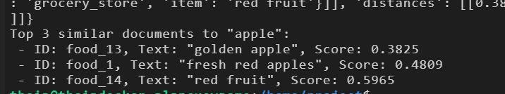

# Similarity Search with ChromaDB

This example stores grocery-related text in ChromaDB and finds the documents
that are semantically most similar to a query. It uses the
`all-MiniLM-L6-v2` Sentence Transformers model to create embeddings and cosine
distance to rank the results.

## What the script does

When `similarity_search.py` runs, it:

1. Creates a ChromaDB client and a collection named `my_grocery_collection`.
2. Configures the collection to use the Sentence Transformers embedding
   function and cosine distance.
3. Defines 14 grocery documents and one unique ID for each document.
4. Adds each document, its metadata, and its ID to the collection.
5. Retrieves the collection contents and prints the document count.
6. Searches for the query `apple` and prints the three closest documents.

The search is semantic. For example, `golden apple`, `fresh red apples`, and
`red fruit` can be returned because their embeddings represent related meaning,
not only because they contain the exact query text.

## Installation

Create and activate a Python virtual environment, then install the required
packages:

```bash
pip install chromadb==1.0.12
pip install torch --index-url https://download.pytorch.org/whl/cpu
pip install sentence-transformers==4.1.0
```

The first run may download the `all-MiniLM-L6-v2` model from Hugging Face.

## Run the example

From the repository directory, run:

```bash
python similarity_search.py
```

The program prints the collection size and the ranked search results. The
distance is lower for results that are more similar to the query.

## How documents and metadata are added

The `documents` and `metadatas` lists are aligned by position:

```python
collection.add(
	documents=texts,
	metadatas=[
		{"source": "grocery_store", "item": text}
		for text in texts
	],
	ids=ids,
)
```

The list comprehension creates one metadata dictionary for every item in
`texts`. Here, `text` is used as the value of the `item` field. If the value
were intentionally unused, the conventional loop variable would be `_`:

```python
[{"source": "grocery_store"} for _ in texts]
```

Each list must contain the same number of entries. In this example, document
number 1, metadata number 1, and ID `food_1` all refer to `fresh red apples`.

## How similarity search works

The collection is queried with one text string:

```python
results = collection.query(
	query_texts=["apple"],
	n_results=3,
)
```

ChromaDB embeds the query using the configured model, compares that embedding
with the stored document embeddings, and returns the three nearest documents.
The result arrays are nested because ChromaDB supports multiple queries at
once, so the first query's IDs are accessed with `results["ids"][0]`.

## Example output



The screenshot shows `golden apple`, `fresh red apples`, and `red fruit`
ranked for the query `apple`. The numeric score is a cosine distance, so a
smaller score indicates greater similarity.

## Project files

| File | Purpose |
| --- | --- |
| `similarity_search.py` | Creates the collection, adds documents, and performs the query. |
| `img/image.png` | Example terminal output from a similarity search. |

